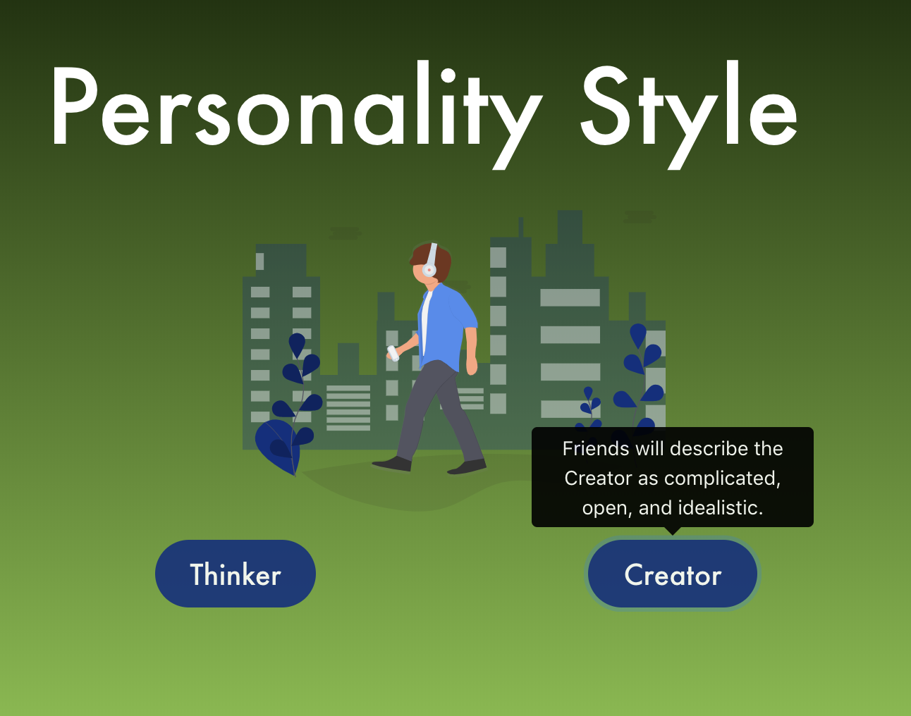

# angular-tooltips-demo

Single page Angular 6 app with interactive tooltips! 🔎

## Tech Stack: 
- Angular 6
- ng-bootstrap v4
- Bootstrap 4

Made with [Angular Webpack Starter](https://github.com/gdi2290/angular-starter)

###### Requirements:
- Node (Version >=8 Recommended)
- NPM
- A modern browser (sorry, Netscape Navigator lovers)

### Functional Requirements
- Single page Angular 4+ app with simple routing that has one state/view ✅
- Place two buttons that when clicked; show a tooltip above the button with some text in it. ✅
- When button A is clicked, if button B’s tooltip is open it should close and vice versa (only one tooltip should be visible at a time) ✅
- Either tooltip should close when clicked anywhere outside of it, but remain open if clicked inside.
- Either tooltip should close when ESC key is pressed. 
  - Both of the above were implemented with ngbTooltip's `[autoClose]="'outside'"` property ✅
- Tooltip functionality should be written as a reusable component ✅
- The reviewer should be able to run your solution with a simple npm command ✅

**BONUS**
- If you scroll down to an open tooltip, it should detect being at the edge of the screen and change position to be below the button ❌
- Style using Bootstrap SASS ✅
- Add at least one accessibility feature ✅

## Usage

###### Installing
```
npm install
```

###### Run
 ```
 npm start

 ```

Your browser should automatically navigate to [http://localhost:3000/](http://localhost:3000/) (if it doesn't, click the link or paste it in your address bar)

## Screenshot


# License
 [MIT](/LICENSE)
